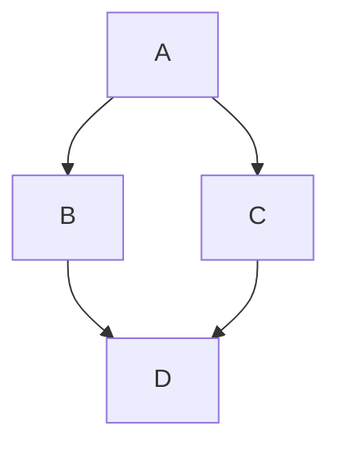

[Bytemd Playground](https://bytemd.js.org/playground/)

[Markdown Basic Syntax on GitHub](https://github.com/tofrankie/blog-test/issues/1)

Updated at 2026.06.01 01:00

```css
.app {
  position: relative;
  display: flex;
  flex-direction: column;
  width: 100vw;
  height: 100vh;
}

.app-title {
  padding: 8px;
}
```


## Markdown Basic Syntax

I just love **bold text**. Italicized text is the _cat's meow_. At the command prompt, type `nano`.

My favorite markdown editor is [ByteMD](https://github.com/bytedance/bytemd).

1. First item
2. Second item
3. Third item

> Dorothy followed her through many of the beautiful rooms in her castle.

```js
import gfm from '@bytemd/plugin-gfm'
import { Editor, Viewer } from 'bytemd'

const plugins = [
  gfm(),
  // Add more plugins here
]

const editor = new Editor({
  target: document.body, // DOM to render
  props: {
    value: '',
    plugins,
  },
})

editor.on('change', (e) => {
  editor.$set({ value: e.detail.value })
})
```

Save the document by pressing <kbd>Ctrl</kbd> + <kbd>S</kbd>

## GFM Extended Syntax

Automatic URL Linking: https://github.com/bytedance/bytemd

~~The world is flat.~~ We now know that the world is round.

- [x] Write the press release
- [ ] Update the website
- [ ] Contact the media

| Syntax    | Description |
| --------- | ----------- |
| Header    | Title       |
| Paragraph | Text        |

> [!NOTE]
> Useful information that users should know, even when skimming content.

> [!TIP]
> Helpful advice for doing things better or more easily.

> [!IMPORTANT]
> Key information users need to know to achieve their goal.

> [!WARNING]
> Urgent info that needs immediate user attention to avoid problems.

> [!CAUTION]
> Advises about risks or negative outcomes of certain actions.


## Footnotes

Here's a simple footnote,[^1] and here's a longer one.[^bignote]

[^1]: This is the first footnote.
[^bignote]: Here's one with multiple paragraphs and code.

    Indent paragraphs to include them in the footnote.

    `{ my code }`

    Add as many paragraphs as you like.

## Gemoji

Thumbs up: :+1:, thumbs down: :-1:.

Families: :family_man_man_boy_boy:

Long flags: :wales:, :scotland:, :england:.

## Math Equation

Inline math equation: $a+b$

$$
\displaystyle \left( \sum_{k=1}^n a_k b_k \right)^2 \leq \left( \sum_{k=1}^n a_k^2 \right) \left( \sum_{k=1}^n b_k^2 \right)
$$

## Mermaid Diagrams


